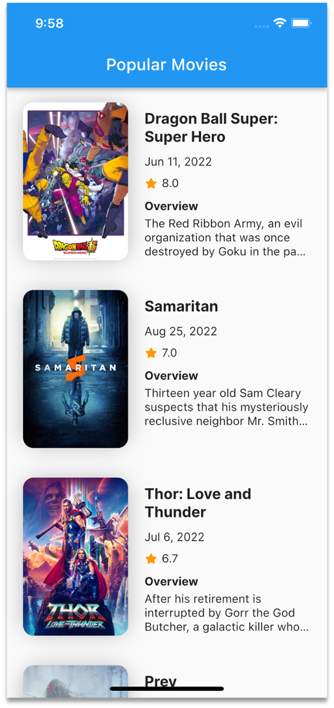
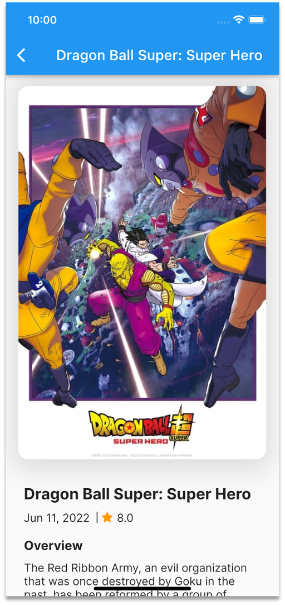

# Flutter HTTP Request dan REST API

## Langkah-langkah Praktikum

### Persiapan Project

1. Mendapatkan API Key dari themoviedb.org

2. Install Library Flutter http menggunakan perintah `flutter pub add http`

### Koneksi ke Rest API

1. Menguji koneksi di dashboard api themoviedb

2. Mengkoneksikan aplikasi Flutter ke themoviedb dengan package http

### Struktur Project

1. Main Page

2. Detail Page

